# GitOps CI/CD Pipeline — Jenkins + SonarQube + Docker + Argo CD + Kubernetes

An end-to-end GitOps CI/CD pipeline for a Java Spring Boot application. Continuous Integration (Jenkins) is fully decoupled from Continuous Delivery (Argo CD), with Git as the single source of truth for the desired cluster state.

---

## Architecture

```
 Developer            Jenkins (CI)                  GitHub (Manifests)        Argo CD (CD)          Kubernetes
 ─────────           ──────────────                 ──────────────────       ─────────────         ───────────
 git push  ───────▶  1. mvn clean package
                     2. SonarQube scan
                     3. Docker build & push
                     4. Update image tag  ────────▶  manifest repo updated
                        (sed in shell script)                                 detects change ─────▶ rolling update
                                                                               (auto-sync +
                                                                                self-heal)
```

**Flow summary**
1. Developers push application code to GitHub.
2. Jenkins builds the Spring Boot app with Maven, runs a SonarQube scan, builds a Docker image, pushes it to Docker Hub, and updates the image tag in the Kubernetes manifest repo.
3. Argo CD watches the manifest repo and automatically syncs any change to the Kubernetes cluster.

---

## Prerequisites

- AWS account (for EC2 host) — or any VM/host capable of running Jenkins + SonarQube
- A Kubernetes cluster (Minikube for local testing, or any managed cluster)
- Docker Hub account
- GitHub account with a Personal Access Token
- Forked copy of the application + manifest repositories

---

## Run the Application Locally

Before setting up the full pipeline, you can build and run the application directly on your machine to confirm it works end to end.

### 1. Checkout the repo and move to the project directory

```bash
git clone https://github.com/iam-veeramalla/Jenkins-Zero-To-Hero/java-maven-sonar-argocd-helm-k8s/sprint-boot-app
cd java-maven-sonar-argocd-helm-k8s/sprint-boot-app
```

### 2. Execute the Maven targets to generate the artifacts

```bash
mvn clean package
```

This stores the build artifact in the `target` directory. You can either run this artifact directly on your machine or run it as a Docker container.

> **Note:** To avoid issues with local Java versions and other dependencies, the Docker route is recommended.

### 3. Run it directly (Java 11 required)

```bash
java -jar target/spring-boot-web.jar
```

Access the application at `http://localhost:8080`.

### 4. The Docker way — build the image

```bash
docker build -t ultimate-cicd-pipeline:v1 .
```

Run the container:

```bash
docker run -d -p 8010:8080 -t ultimate-cicd-pipeline:v1
```

Hurray! Access the application at `http://<ip-address>:8010`.

### 5. Next steps — set up a local SonarQube server

```bash
# System requirements:
#   Java 17+ (Oracle JDK, OpenJDK, or AdoptOpenJDK)
#   Minimum 2 GB RAM, 2 CPU cores

sudo apt update && sudo apt install unzip -y
adduser sonarqube
wget https://binaries.sonarsource.com/Distribution/sonarqube/sonarqube-10.4.1.88267.zip
unzip *
chown -R sonarqube:sonarqube /opt/sonarqube
chmod -R 775 /opt/sonarqube
cd /opt/sonarqube/bin/linux-x86-64
./sonar.sh start
```

Hurray! You can now access the SonarQube server at `http://<ip-address>:9000`.

---

## 1. Provision Infrastructure

- Launch an AWS EC2 Ubuntu instance — **t2.large** (2 vCPU / 8 GB RAM) minimum, since Jenkins and SonarQube are memory-hungry.
- Open inbound security group rules for:
  - `8080` — Jenkins
  - `9000` — SonarQube
- SSH into the instance using your PEM key.

<p align="center">
  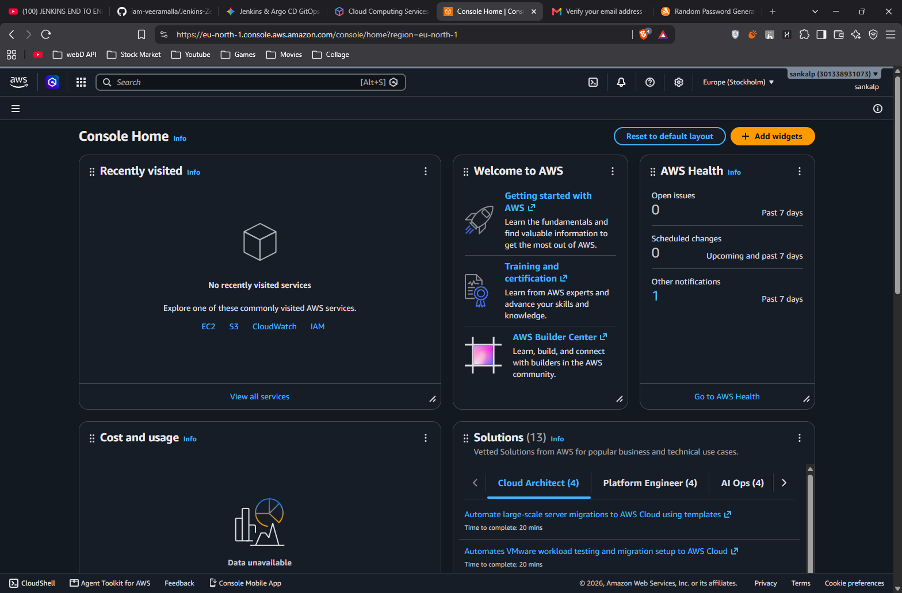
  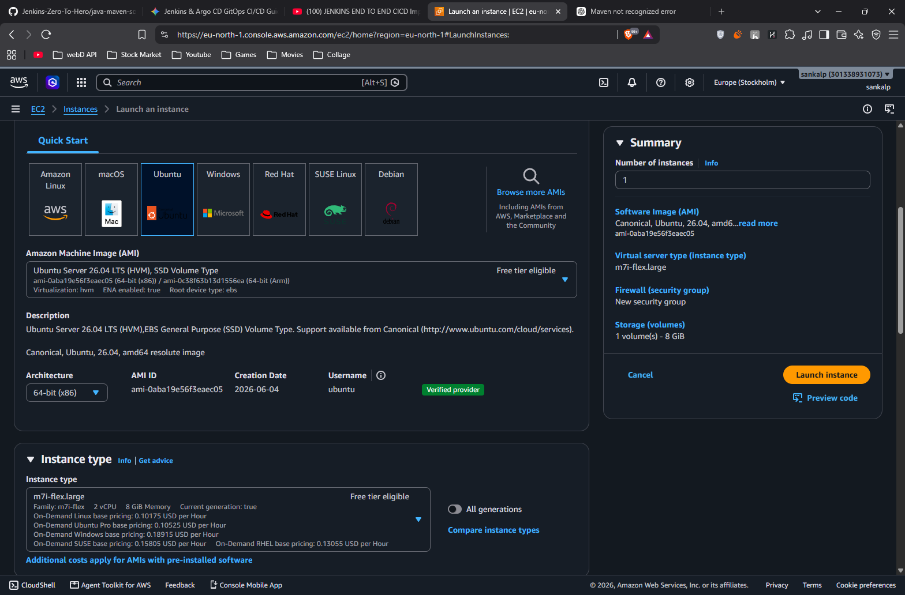
</p>
<p align="center">
  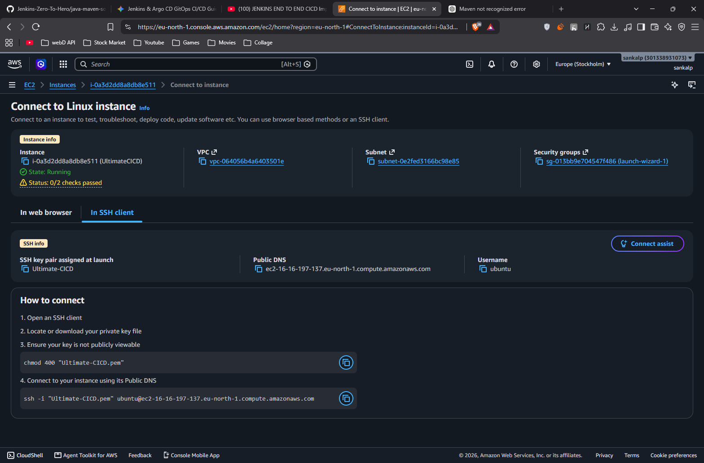
</p>

**Screenshot notes:**
- **AWS_setup.png** — the AWS Management Console, showing the starting point before any resources are launched.
- **EC2_Setup.png** — the EC2 instance-launch wizard, where the instance type (t2.large), AMI, key pair, and security group are configured.
- **connect_to_ec2.png** — an active SSH session into the newly launched EC2 instance, confirming the host is reachable and ready for setup.

## 2. Install & Configure Jenkins

```bash
sudo apt update
sudo apt install openjdk-11-jdk -y
# Add the Jenkins apt keyring & repository, then:
sudo apt install jenkins -y
```

- Access Jenkins at `http://<EC2-Public-IP>:8080`
- Get the initial admin password:
  ```bash
  sudo cat /var/lib/jenkins/secrets/initialAdminPassword
  ```
- Complete the setup wizard, then install these plugins under **Manage Jenkins → Plugins → Available Plugins**:
  - `Docker Pipeline`
  - `SonarQube Scanner`

<p align="center">
  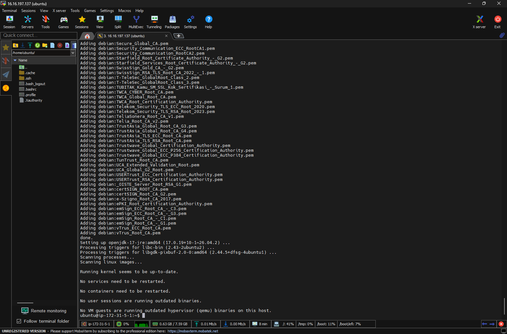
  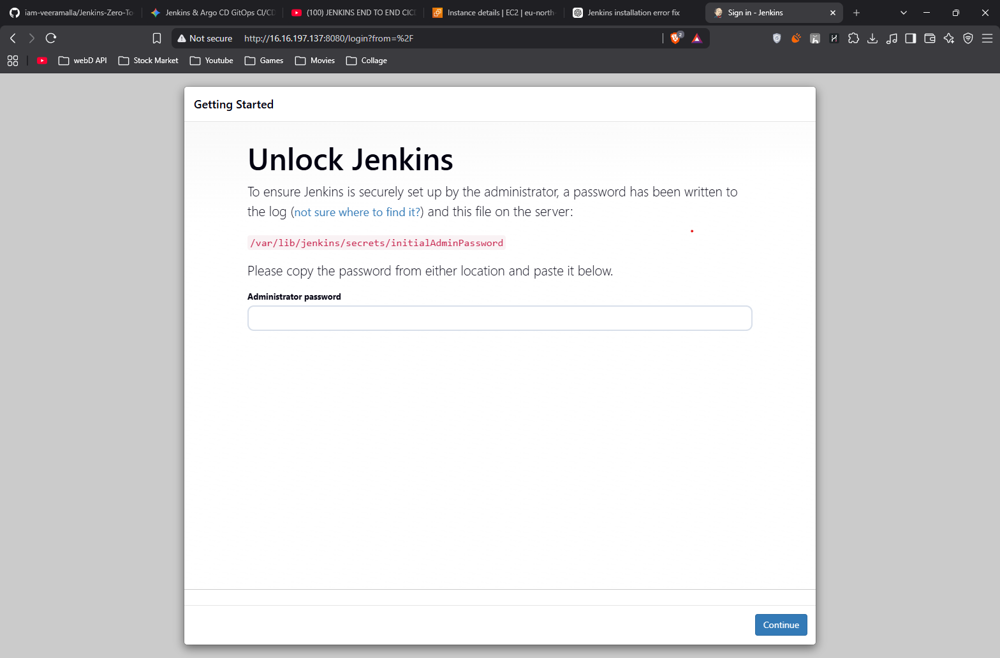
</p>
<p align="center">
  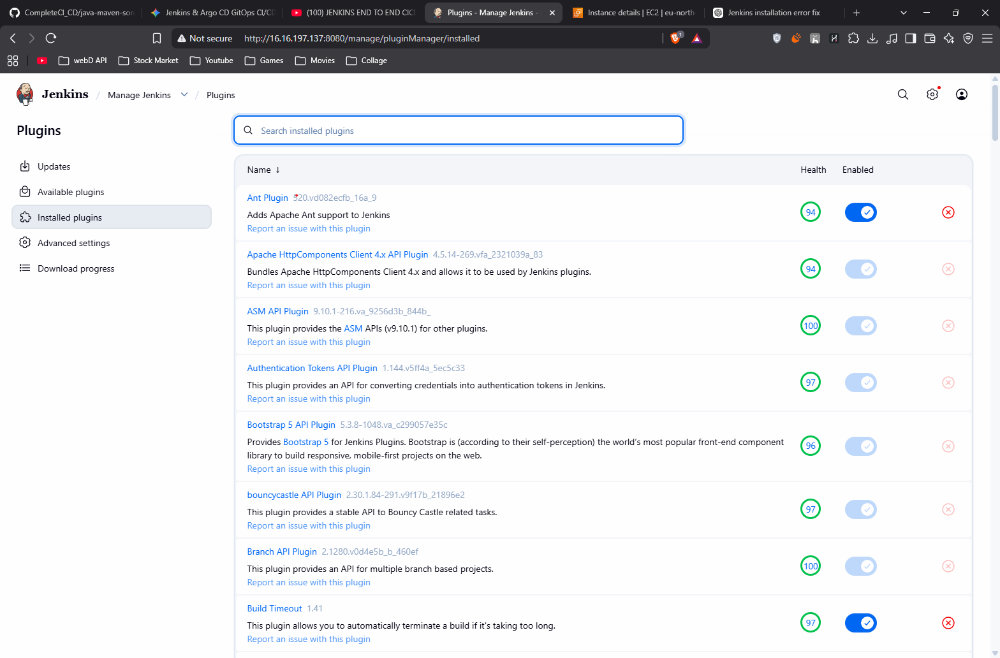
</p>

**Screenshot notes:**
- **install_jdk.png** — terminal output confirming OpenJDK 11 has installed successfully on the EC2 host, a prerequisite for running Jenkins.
- **ec2_jenkins.png** — the Jenkins "Unlock Jenkins" screen, where the initial admin password (read from the server) is entered to complete first-time setup.
- **install_jenkins_plugins.png** — the Jenkins plugin manager showing `Docker Pipeline` and `SonarQube Scanner` installed and ready to use in the pipeline.

## 3. Set Up SonarQube

```bash
sudo adduser sonarqube
sudo su - sonarqube

wget https://binaries.sonarsource.com/Distribution/sonarqube/sonarqube-9.9.0.65466.zip
unzip sonarqube-*.zip

./sonarqube-*/bin/linux-x86-64/sonar.sh start
```

- Access SonarQube at `http://<EC2-Public-IP>:9000` (default login: `admin` / `admin`)
- Go to **My Account → Security** and generate an authentication token named `Jenkins`

## 4. Configure Jenkins Tools & Credentials

Install Docker on the host and let Jenkins use it:

```bash
sudo apt install docker.io -y
sudo usermod -aG docker jenkins
sudo systemctl restart docker
sudo systemctl restart jenkins
```

<p align="center">
  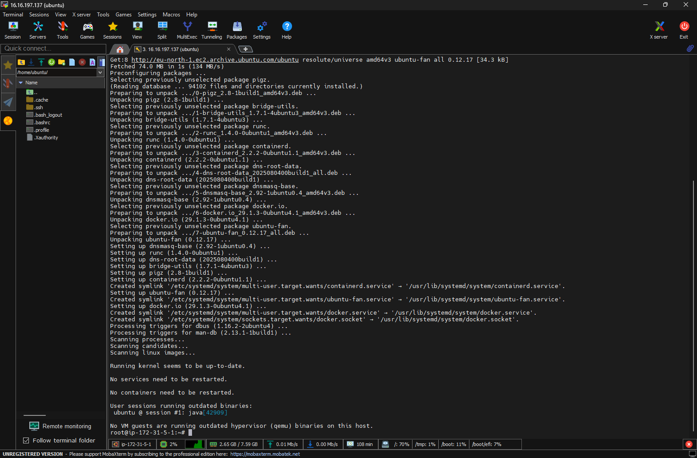
</p>

**Screenshot note:**
- **install_docker_on_EC2_server.png** — terminal output confirming Docker has been installed on the EC2 host and the `jenkins` user has been added to the `docker` group so Jenkins can run Docker builds without permission errors.

Under **Manage Jenkins → Credentials → System → Global Credentials**, add:

| Credential                  | Type               | ID            |
|------------------------------|--------------------|--------------|
| SonarQube token               | Secret text         | `sonar-token` |
| Docker Hub username/password  | Username & password | `docker-cred` |
| GitHub Personal Access Token  | Secret text         | `github`      |

<p align="center">
  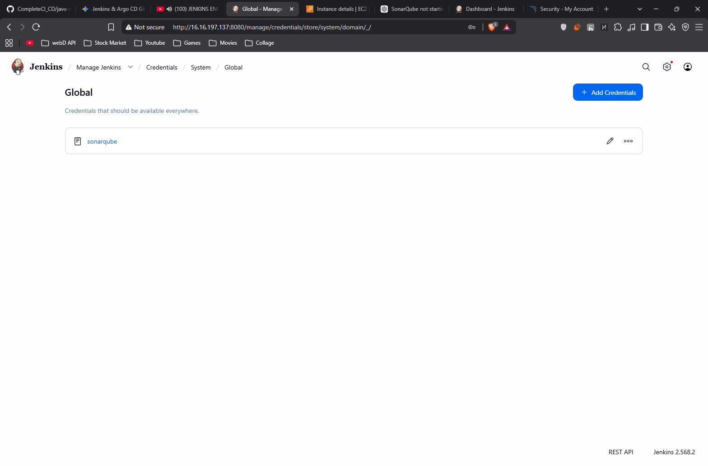
  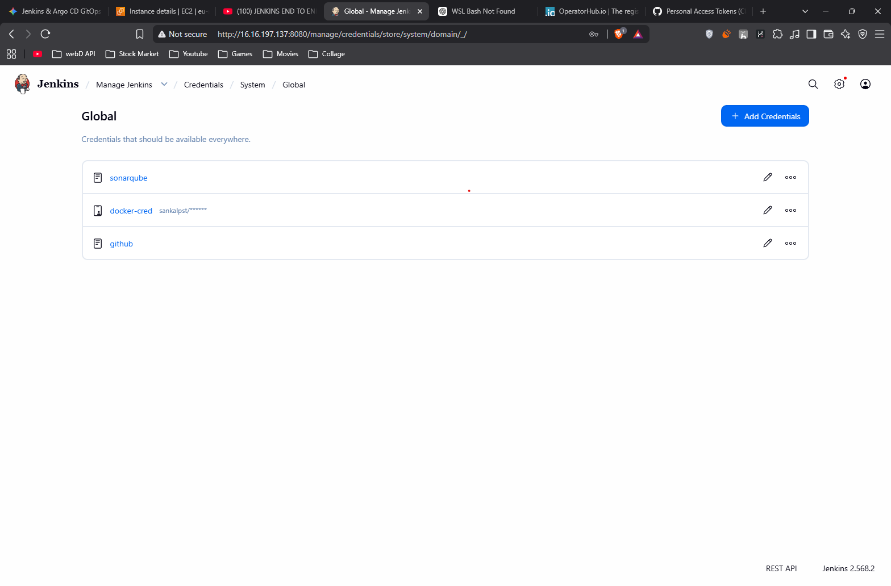
</p>

**Screenshot notes:**
- **added_sonar_cofig_to_jenkins.png** — the Jenkins credentials store showing the SonarQube authentication token saved under the ID `sonar-token`.
- **added_all_the_credentials_.png** — the full Jenkins Global Credentials list, showing the SonarQube token, Docker Hub credentials, and GitHub PAT all configured and ready for the pipeline to reference.

## 5. Create the Pipeline

Fork the sample project repository (e.g. `AbhishekVeeramalla/Jenkins-Zero-To-Hero`).

The `Jenkinsfile` runs these stages:

1. **Build & Test** — `mvn clean package`
2. **SonarQube Scan** — `mvn sonar:sonar`
3. **Docker Build & Push** — containerizes the built `.jar` and pushes the image to Docker Hub
4. **Manifest Update** — uses `sed` in a shell step to bump the image tag in the Kubernetes deployment YAML

In Jenkins, create a **Pipeline** job:
- SCM: your forked GitHub repo URL
- Branch: `main`
- Script path: `spring-boot-app/Jenkinsfile`

<p align="center">
  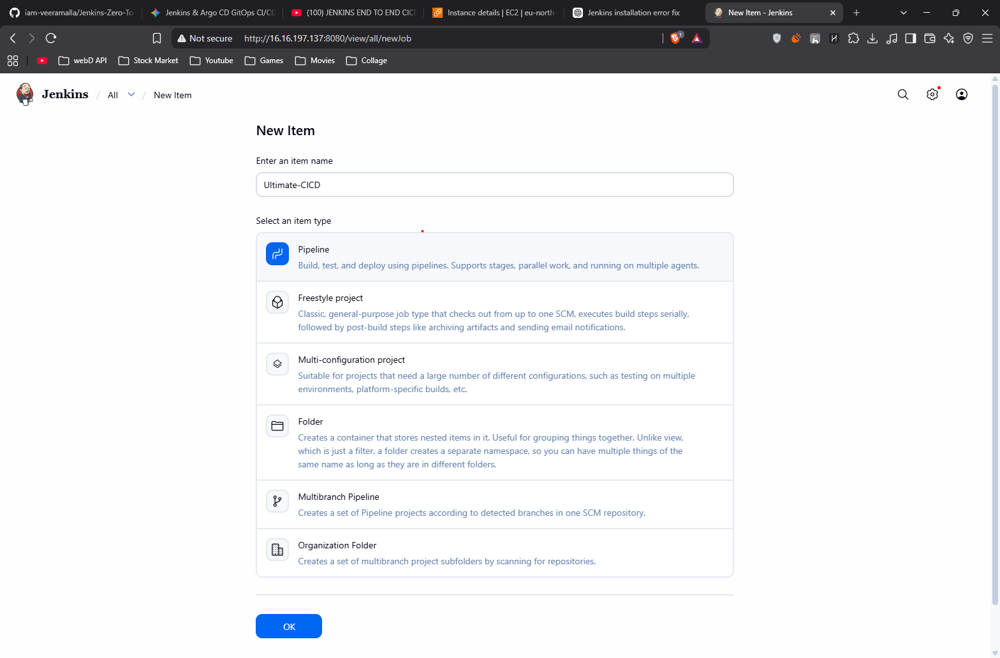
</p>
<p align="center">
  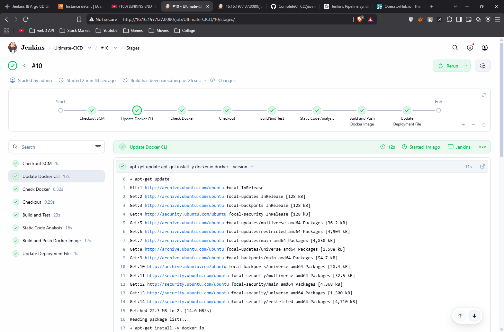
</p>

**Screenshot notes:**
- **Create_a_Pipeline_in_Jenkins.png** — the Jenkins "New Item" pipeline configuration screen, pointing to the forked repo, branch, and Jenkinsfile path.
- **after_10_attemps_ci_pipeline_was_done.png** — the Jenkins pipeline stage view with every stage (Build, SonarQube Scan, Docker Build & Push, Manifest Update) shown green, confirming a fully passing CI run after debugging earlier failed attempts.

## 6. Install Argo CD & Deploy

Start a cluster (example uses Minikube):

```bash
minikube start --driver=hyperkit
```

<p align="center">
  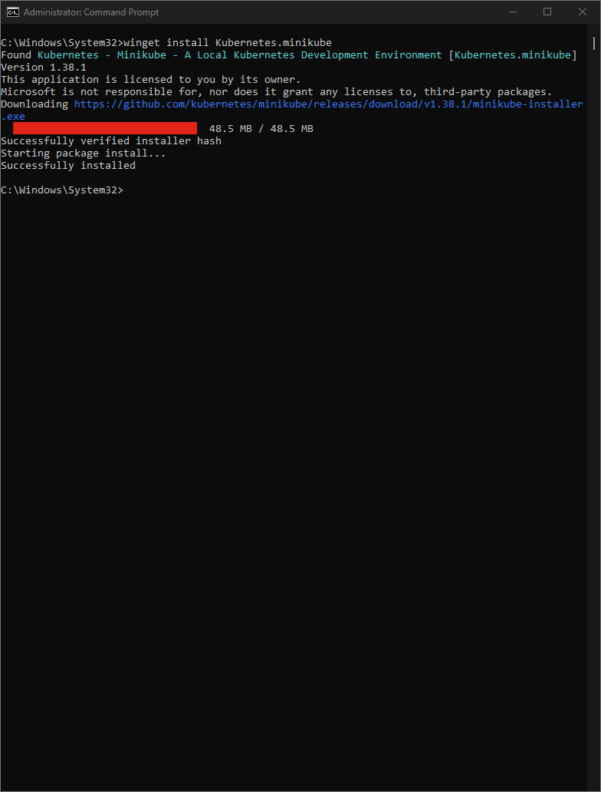
</p>

**Screenshot note:**
- **install_minikube.png** — terminal output showing Minikube starting up and the local Kubernetes cluster becoming ready.

Install Argo CD:

```bash
kubectl create namespace argocd
kubectl apply -n argocd -f https://raw.githubusercontent.com/argoproj/argo-cd/stable/manifests/install.yaml
```

<p align="center">
  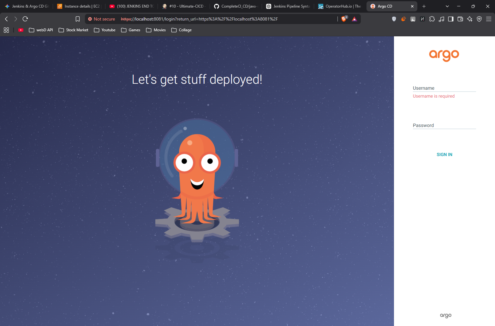
  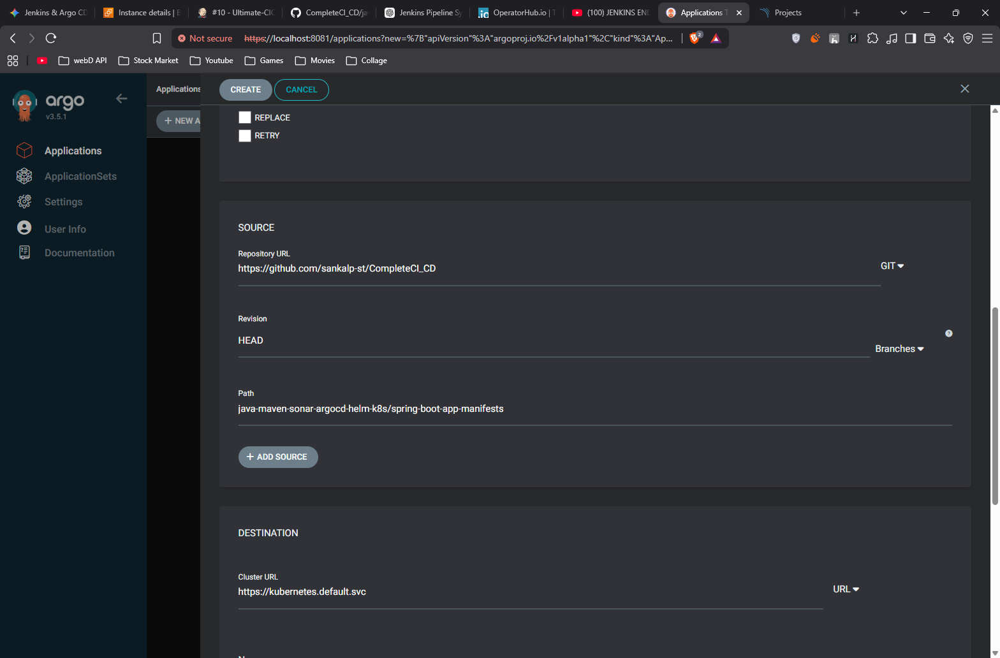
</p>

**Screenshot notes:**
- **install_argoCD_in_local_k8s_cluster.png** — the Argo CD web UI login page, confirming Argo CD has been installed successfully into the `argocd` namespace and is reachable.
- **setup_argoCD.png** — the Argo CD "New App" creation form, with the manifest repo URL, destination cluster, and namespace being filled in, plus Automated Sync and Self-Healing being enabled.

Expose the Argo CD server (change the service to `NodePort`, or use `kubectl port-forward`).

Get the initial admin password:

```bash
kubectl -n argocd get secret argocd-initial-admin-secret -o jsonpath="{.data.password}" | base64 -d
```

In the Argo CD UI:
1. Click **New App**
2. Repository URL → your manifests repo (e.g. `spring-boot-app-manifests`)
3. Cluster URL → `https://kubernetes.default.svc`
4. Namespace → `default`
5. Enable **Automated Sync** and **Self-Healing**

---

## Verification

- **CI**: Trigger the Jenkins pipeline manually or via a GitHub webhook. Confirm the SonarQube report at `http://<EC2-Public-IP>:9000`.
- **CD**: Once Jenkins commits the new image tag, Argo CD detects the change in the manifest repo and performs a rolling update on the Kubernetes deployment automatically.

### Before CI/CD — running locally via Docker (port 8010)

<p align="center">
  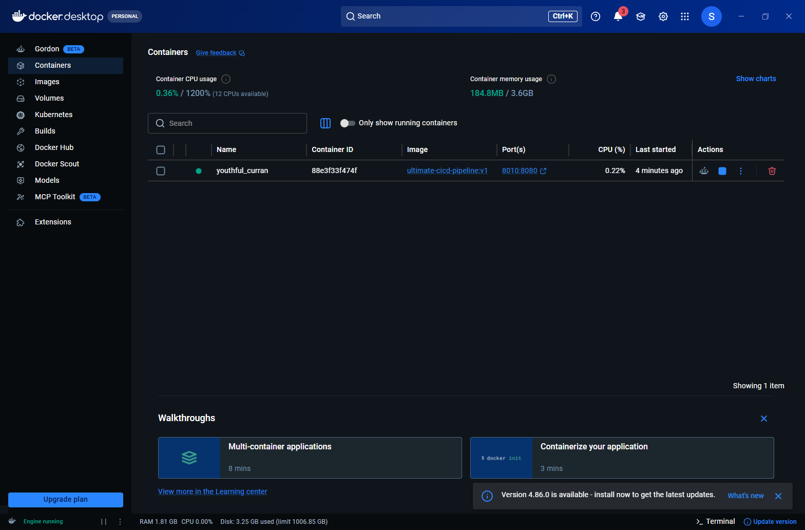
  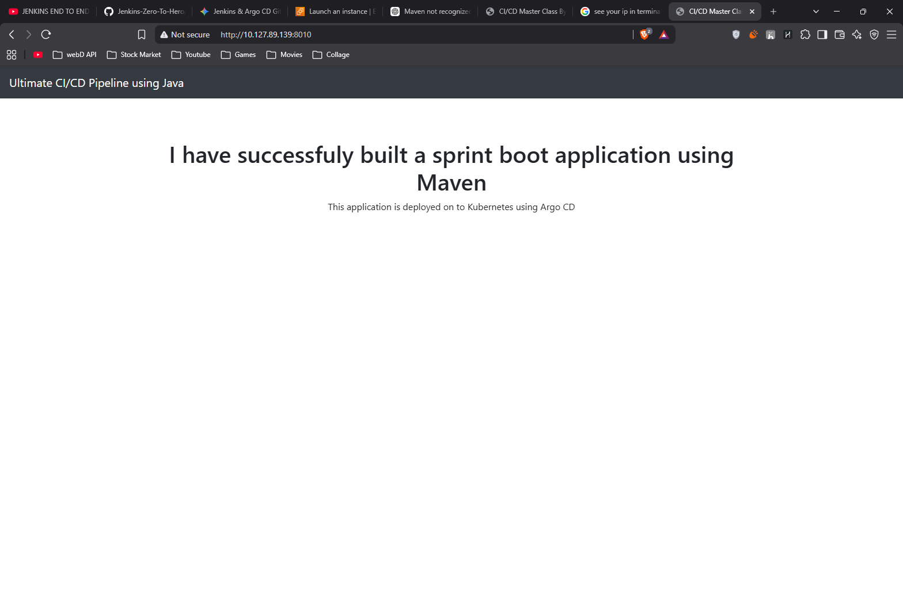
</p>

**Screenshot notes:**
- **DockerContainer_in_local.png** — Docker Desktop showing the `ultimate-cicd-pipeline` container running locally, mapped to port `8010`, before any CI/CD pipeline is involved.
- **run_app_through_docker_container.png** — the Spring Boot application successfully responding in the browser at `http://<ip-address>:8010`, confirming the manually built Docker image works standalone.

### Before CI/CD — running locally on port 8081

<p align="center">
  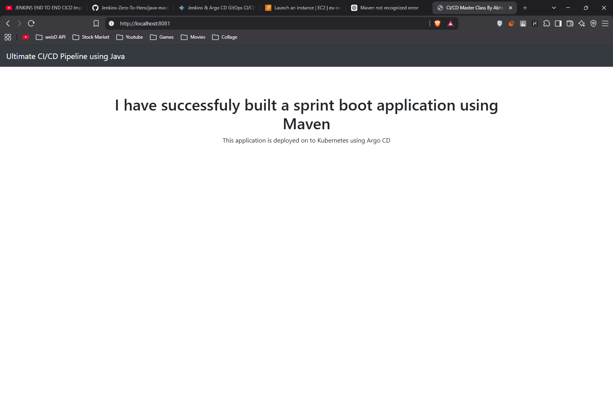
</p>

**Screenshot note:**
- **app_running_on_localhost.png** — the application running on `http://localhost:8081`, another pre-pipeline local run used to sanity-check the build before it's wired into Jenkins and Argo CD.

### Docker image built and pushed during the CI pipeline

<p align="center">
  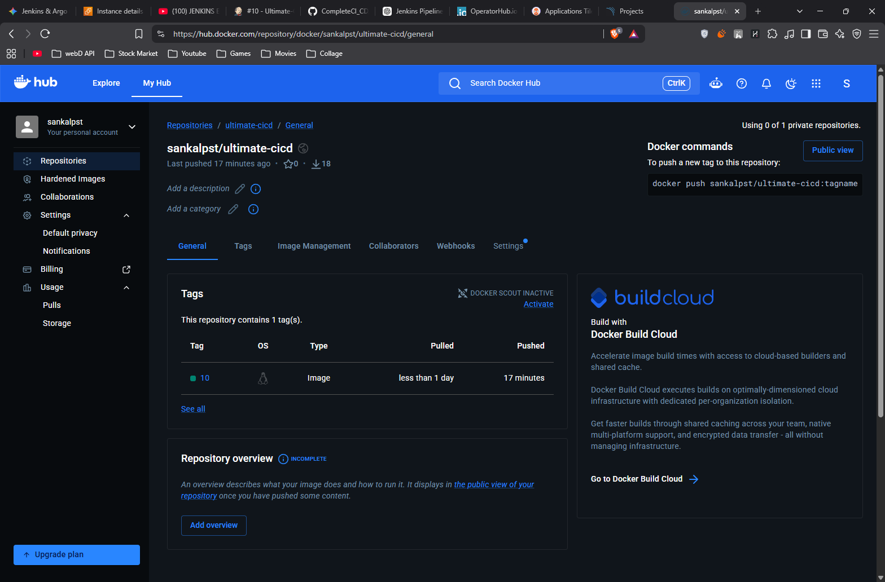
</p>

**Screenshot note:**
- **docker_image_created_after_complete_cicd_.png** — Docker Hub showing the image that Jenkins built and pushed automatically as part of the CI pipeline, tagged with the new build version.

### After complete CI/CD — running on the Kubernetes cluster (port 8082)

<p align="center">
  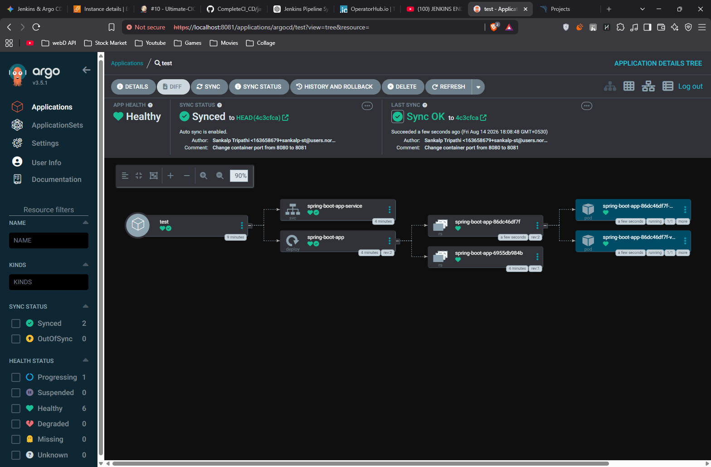
</p>

**Screenshot note:**
- **complete_argoCD_setup.png** — the Argo CD dashboard showing the application in a **Synced** and **Healthy** state, confirming the manifest repo change was automatically picked up and rolled out to the cluster.

<p align="center">
  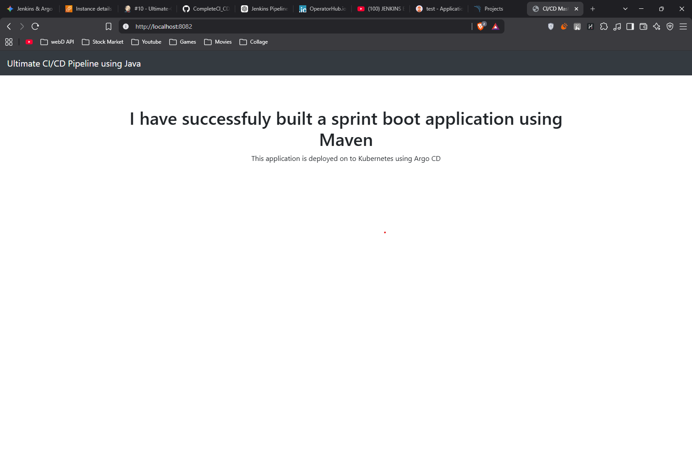
</p>

**Screenshot note:**
- **final_result_which_is_running_on_the_EC2_server_with_complete_CICD.png** — the final, end-to-end result: the application running on port `8082`, served from the Kubernetes cluster after the full GitOps pipeline (Jenkins → manifest repo → Argo CD → cluster rollout) completed automatically, with no manual deployment step.

---

## Tech Stack

- **CI**: Jenkins, Maven, SonarQube, Docker, Docker Hub
- **CD**: Argo CD (GitOps)
- **Runtime**: Kubernetes (Minikube for local dev)
- **App**: Java Spring Boot

---

> Based on the workflow demonstrated in Abhishek Veeramalla's "Jenkins Zero to Hero" GitOps tutorial.
